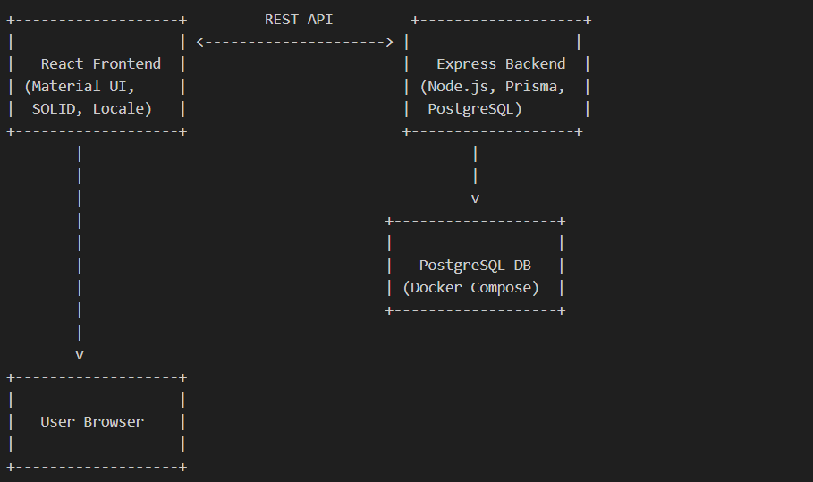

# High-Throughput Flash Sale System

## System Overview

A robust, scalable flash sale platform for a single product with limited stock. Built with Node.js (Express), TypeScript, PostgreSQL (Prisma), and React (Material UI). Includes concurrency control, stress tests, and clear system diagram.

## System Diagram



**Description:**

- Users interact with the React frontend (Material UI, SOLID, locale).
- The frontend communicates with the Express backend via REST API endpoints.
- The backend uses Prisma ORM to manage data in a PostgreSQL database (running in Docker).
- All business logic, concurrency control, and sale rules are enforced in the backend.
- The system is containerized for local cloud simulation and easy scaling.

**Diagram Explanation:**

- **User Browser:** End users interact with the system via a modern React frontend.
- **React Frontend:** Built with Material UI and SOLID principles, handles UI, locale, and calls backend APIs.
- **Express Backend:** Node.js server using Prisma ORM, enforces business logic, concurrency control, and sale rules.
- **PostgreSQL Database:** Stores product stock and user purchases, managed via Prisma and containerized with Docker Compose.
- **Docker Compose:** Orchestrates backend, frontend, and database for local cloud simulation and easy scaling.
- **REST API:** Connects frontend and backend, exposing endpoints for sale status, purchase, and user status.

## Project Structure

```
bookipi-fe-be/
  backend/
    ...
  frontend-sale-app/
    ...
  docker-compose.yml
  README.md
  diagram.png
```

## Architecture

- **Backend:** Node.js API server (Express, Prisma, PostgreSQL)
- **Frontend:** React app (Material UI)
- **Concurrency Control:** DB-backend, prevents overselling and double purchases
- **Testing:** Unit, integration, and stress tests
- **Cloud Simulation:** Docker Compose for local DB and services

## Setup Instructions

1. **Clone the repo:**
   ```bash
   git clone <your-repo-url>
   cd bookipi-fe-be
   ```
2. **Start all services (backend, frontend, db):**
   ```bash
   docker-compose up --build
   ```
3. **Install dependencies (if running locally):**
   ```bash
   cd backend && npm install
   cd ../frontend-sale-app && npm install
   ```
4. **Run Prisma migrations:**
   ```bash
   cd backend
   npx prisma generate
   npx prisma migrate dev --name init
   ```
5. **Start backend and frontend separately (if not using Docker Compose):**
   ```bash
   cd backend && npm start
   cd ../frontend-sale-app && npm start
   ```

## Running Tests

- **Backend:**
  ```bash
  cd backend
  npm test
  ```
- **Stress Test:**
  ```bash
  cd backend
  npm test
  # Stress test included in test suite; see tests/stress/SaleService.stress.test.ts
  ```

## Stress Test Results

- Simulates 1000 concurrent users
- Verifies no overselling and only one purchase per user
- Expected outcome: Stock never goes below zero, no duplicate purchases

## Design Choices & Trade-offs

- **SOLID Principles:** Separation of concerns, modular services, maintainable code
- **Scalability:** DB-backend, Dockerized, ready for cloud extension
- **Fault Tolerance:** Persistent storage, easy recovery
- **Pragmatism:** Trade-offs explained in code and README
